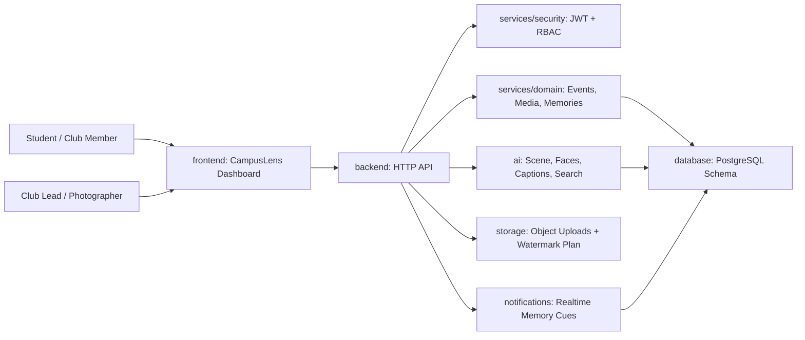

# CampusLens Architecture

CampusLens is organized as a modular monorepo with explicit boundaries for product UI, API routing, domain logic, AI services, storage, database design, and notifications.

## Runtime Flow

1. Users log in with a CampusLens role.
2. The backend signs a JWT-style token and applies RBAC on protected routes.
3. Event and media routes return role-aware data.
4. AI modules enrich media with scene labels, captions, quality scores, face clusters, duplicate groups, and recommendations.
5. The front end renders a mobile-first dashboard with event timelines, heatmaps, galleries, QR album sharing, and personalized feeds.

## Layer Responsibilities

| Layer | Responsibility |
| --- | --- |
| `frontend/` | Product UI, event dashboard, gallery cards, mobile-first layout |
| `backend/` | HTTP server, routing, middleware, API contracts |
| `services/domain/` | CampusLens business logic for events, media, memories, leaderboards |
| `services/security/` | JWT signing, token verification, RBAC permissions, password hashing |
| `ai/` | Scene detection, face clustering, smart search, captions, recommendations |
| `storage/` | Upload intents, storage keys, watermark download policies |
| `notifications/` | Notification creation, read state, memory cue templates |
| `database/` | PostgreSQL schema, relationships, indexes, seed data |

## Production Readiness

- JWT-style authentication with signed claims
- Role Based Access Control for event and media operations
- IP-based rate limiting
- Audit log records for API outcomes
- Error monitoring abstraction
- Docker image and Compose file
- GitHub Actions CI for syntax checks and service tests
- Environment-driven configuration
